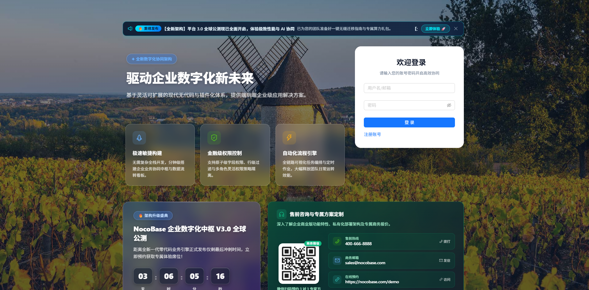
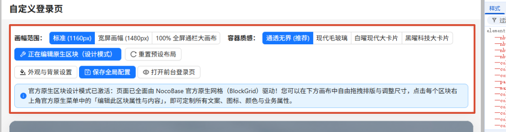
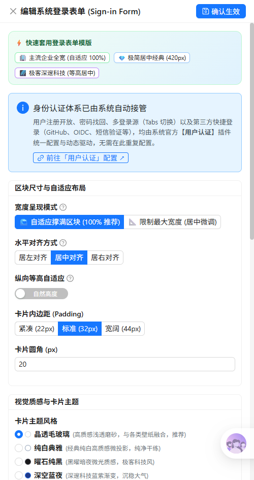
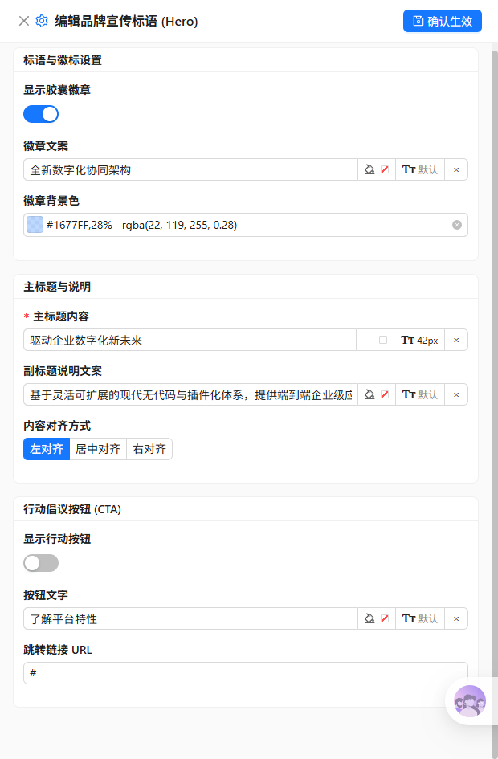
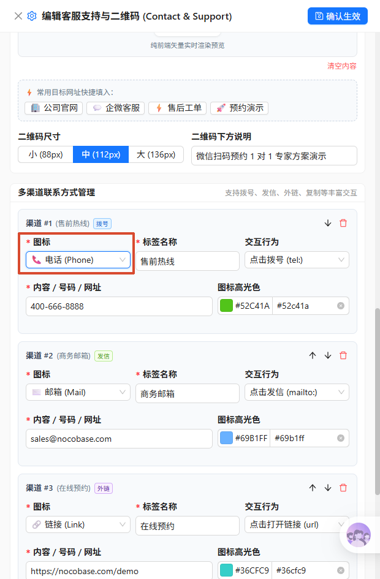

# @nocobase/plugin-custom-login-page

<p align="center">
  <a href="https://www.nocobase.com/">
    
  </a>
</p>

<h3 align="center">Enterprise Visual Custom Login Page & Module Extension Plugin for NocoBase</h3>

<p align="center">
  <strong>Tailored for Enterprise Digital Portals: FlowEngine Native Grid Driven · 14 Out-of-the-Box Blocks · Dual-Mode WYSIWYG Studio Designer · High-Concurrency Memory Cache · Financial-Grade Security Defense</strong>
</p>

<p align="center">
  <a href="./README.md"><b>简体中文</b></a> | <a href="./README.en-US.md"><b>English</b></a>
</p>

<p align="center">
  
  
  
  
  
  
</p>

---

## 📸 Visual Showcase

### 1. Full-Featured Login Page Preview (Modern Client-v2 Live Runtime)
> Complete with top announcement bar, corporate hero slogan, 3-column features matrix, release countdown clock, multi-channel support with offline vector QR code, and modern authentication card.

<p align="center">
  
</p>

### 2. Dual-Layer Studio Designer (Workbench Studio Bar)
> Instant master activation switch, smooth mode switching (Design Mode ↔ Visitor Preview), 3 canvas widths (Standard / Widescreen / 100% Stretch), and 4 material themes.

<p align="center">
  
</p>

### 3. Visual Block Configuration Drawers
<p align="center">
  
  
  
</p>
<p align="center">
  <em>From left to right: Authentication Form Settings · Brand Hero Slogan & CTA Settings · Multi-channel Support & Vector QR Settings</em>
</p>

---

## 📖 Background & Design Philosophy

The login page is the **front door and primary brand portal** of any enterprise application. However, conventional business systems and low-code platforms often present significant limitations:

1. **Rigid Layout & Weak Branding**: Default login screens typically consist of a single 320px column, making it difficult to present brand slogans, key milestones, customer showcases, or visual banners;
2. **Lack of Public Service & Information Channels**: Before logging in, organizations often need to present maintenance announcements, support contacts, QR codes, or countdown events, which native login forms cannot accommodate;
3. **High Customization Cost & Upgrade Conflicts**: Traditional modifications require patching core frontend source code or reverse-proxy rewriting, which frequently breaks during platform upgrades.

**`@nocobase/plugin-custom-login-page`** completely resolves these pain points. Built seamlessly upon the NocoBase 2.x **Modern Client-v2** architecture and **FlowEngine** native card grid engine, it delivers a drag-and-drop, turnkey visual builder with 14 specialized login blocks, millisecond-level memory caching, and enterprise-grade security.

---

## 🌟 Key Features Overview

### 1. 🧱 100% FlowEngine Native Grid-Driven
- **Fluid Grid Layout**: Move beyond rigid static templates with full drag-and-drop support, dynamic additions/deletions, and customizable column spans (Span 1~24);
- **Responsive Breakpoint Adaptation**: Automatic wrapping and flexible alignment across large monitors, laptops, and mobile viewports.

### 2. 🎨 Immersive Dual-Layer Studio Workbench
- **Instant Activation Toggle**: Persistent `[Custom Login Page: Active / Inactive]` master switch capsule for one-click toggling with instant memory cache synchronization;
- **Smooth Dual-Mode Switching**:
  - `[🛠️ Design Mode]`: Freely add blocks, rearrange items, adjust dimensions, and configure block properties in real-time drawer panels;
  - `[👁️ Visitor Preview]`: 1:1 preview of the visitor experience directly inside the workbench with all drag handles and outline borders hidden;
- **Global Canvas Customization**:
  - **3 Canvas Widths**: Fixed Centered (800px / 960px), Widescreen Centered (1200px), and 100% Full-Width Stretch;
  - **4 Material Themes**: Glassmorphism, Elegant White Card, Dark Obsidian, and Seamless Transparent.

### 3. 📦 14 Enterprise-Grade Built-in Block Components

| Block Model | Description | Typical Use Case |
| :--- | :--- | :--- |
| **`SignInFormBlockModel`** | **Authentication Form**: Enterprise logo, custom titles/subtitles, 5 card themes, auto-height, reinforced full-screen breakout on `/v/signin` | Core system authentication |
| **`CustomHeroBlockModel`** | **Brand Hero Slogan**: Capsule badge, headline, rich subtitle, and quick Call-to-Action (CTA) button | Corporate branding and slogan |
| **`CustomFeaturesBlockModel`** | **Enterprise Features Grid**: Multi-column cards with custom icons, accent colors, and descriptions | Product capabilities & highlights |
| **`CustomStatsBlockModel`** | **Key Metrics Dashboard**: Operational metrics with highlighted statistics, units, and prefixes/suffixes | Showcasing scale and credibility |
| **`CustomCarouselBlockModel`** | **Dynamic Panorama Carousel**: Multi-slide poster gallery with auto-play interval and external link navigation | Event promotions and banners |
| **`CustomHtmlBlockModel`** | **Custom HTML / Code**: Inline rich text and embed code with built-in XSS sanitizer | Custom components & script embeds |
| **`CustomImageBlockModel`** | **Hero Illustration / Brand Image**: High-definition illustration, rounded corners, soft shadows, and external links | Product illustrations & posters |
| **`CustomNoticeBlockModel`** | **System Announcements**: Marquee rotation, notice level badges (Info/Warning/Success), and visitor dismissal | Maintenance notices & updates |
| **`CustomPartnersBlockModel`** | **Partner & Client Logo Wall**: Grid matrix of partner logos with grayscale hover filter and external links | Customer proofs & partnerships |
| **`CustomContactBlockModel`** | **Support Channels & Offline QR**: Multiple contact capsules and pure frontend vector QR code cards | Helpdesk, support groups, WeChat QR |
| **`CustomLanguageBlockModel`** | **Language Switcher Capsule**: Multi-format quick language switcher integrated with NocoBase i18n | Multi-lingual & global portals |
| **`CustomCountdownBlockModel`** | **Event Countdown Timer**: Real-time countdown clock and call-to-action button | Major release or deadline countdown |
| **`CustomLoginContainer`** | **Base Login Container**: Fluid responsive container with custom background image and mask opacity | Global background & container setup |
| **`PublicWorkflowTrigger`** | **Public Workflow & Modal Trigger**: Publicly triggers NocoBase workflows with anti-abuse challenge | Visitor registration & public intake |

### 4. 🛡️ High-Concurrency & Production Security Defense
- **Zero Database Reads for High Traffic**: Dual-layer cache architecture where unauthenticated visitor requests hit in-memory cache directly, preventing database overload;
- **Whitelist Parameter Sanitization (`sanitizeConfigValues`)**: Rigorous filtration of unauthorized fields and injection attacks;
- **Trusted Proxy IP Rate Limiting**: Real-client IP rate limiting to mitigate automated scraping and abuse;
- **React Error Boundary Fallback**: Sub-millisecond graceful fallback to the official native login form if any custom block throws an error—**guaranteeing zero white-screen outages**;
- **Multi-Channel Icon Ecosystem**: Seamless integration with `@nocobase/plugin-custom-icons` for custom SVGs and Alibaba Iconfont, with automatic fallback to native icons.

---

## 🚀 Installation & Deployment

### Method 1: Via NocoBase Plugin Manager (Recommended)

1. Download the latest release archive (`.zip` or `.tgz`) from GitHub [Releases](https://github.com/STlxx-lin/nocobase-plugin-custom-login-page/releases);
2. Log in to the NocoBase admin console, open **Plugin Manager** in the top right corner, and click **Upload Plugin**;
3. Select the downloaded package and click **Enable Plugin** after upload completes.

### Method 2: Via Source Code

```bash
# 1. Navigate to NocoBase plugins directory
cd packages/plugins/@nocobase

# 2. Clone the repository
git clone https://github.com/STlxx-lin/nocobase-plugin-custom-login-page.git plugin-custom-login-page

# 3. Compile the plugin
yarn build @nocobase/plugin-custom-login-page

# 4. Enable plugin and execute database migrations
yarn nocobase pm enable @nocobase/plugin-custom-login-page
yarn nocobase upgrade
```

---

## 💻 Configuration & User Guide

1. **Access the Studio**:
   - Log in with administrator credentials, navigate to Settings, and select **"Custom Login Page"** from the left menu;
2. **Enable Custom Login Page**:
   - In the top workbench bar, toggle the **"Custom Login Page"** status switch to **"Active"**;
3. **Add and Arrange Blocks**:
   - Click **"+ Add Block"** to select from 14 block categories;
   - Drag to reorder cards and adjust column spans (e.g., Hero block spanning 14 columns on the left, login form spanning 10 columns on the right);
4. **Customize Content & Style**:
   - Click the **Gear (Settings)** icon on any block to configure text, logo URLs, theme styles, and action buttons in the drawer panel;
5. **Preview & Go Live**:
   - Switch to **"Visitor Preview"** mode to verify the visual experience;
   - Changes are saved in real time and synchronized with server cache—visitors navigating to `/signin` or `/v/signin` will see the custom layout immediately!

---

## 🛠️ Local Development & Build

```bash
# Build client bundle only
yarn build @nocobase/plugin-custom-login-page --client

# Build server bundle only
yarn build @nocobase/plugin-custom-login-page --server

# Full build (Client, Client-v2, Server, and TypeScript definitions)
yarn build @nocobase/plugin-custom-login-page
```

---

## 🔄 Automated Cloud Packaging (CI/CD)

This repository includes a pre-configured GitHub Actions workflow ([`.github/workflows/release.yml`](.github/workflows/release.yml)) featuring:

- ⚡ **Intelligent Dependency Caching**: Caches Yarn offline packages, reducing build times by up to 70%;
- 🔁 **Network Resilience**: Automatic retry mechanisms (up to 4 attempts) for transient registry connection issues;
- 🔍 **Build Integrity Verification**: Pre-flight verification of `server.js`, `client.js`, `client-v2.js`, and distribution bundles before packaging;
- 📦 **Clean Distribution**: Bundles only runtime essentials, generating clean `.tgz` and `.zip` packages;
- 🔐 **SHA256 Checksums**: Automatically generates `sha256sums.txt` for release verification and auditing;
- 🏷️ **Automated Releases**: Generates GitHub Releases with auto-versioning and release notes upon pushing tags or to `main`.

---

## 📄 License

This project is open-source under the [AGPL-3.0 License](LICENSE).